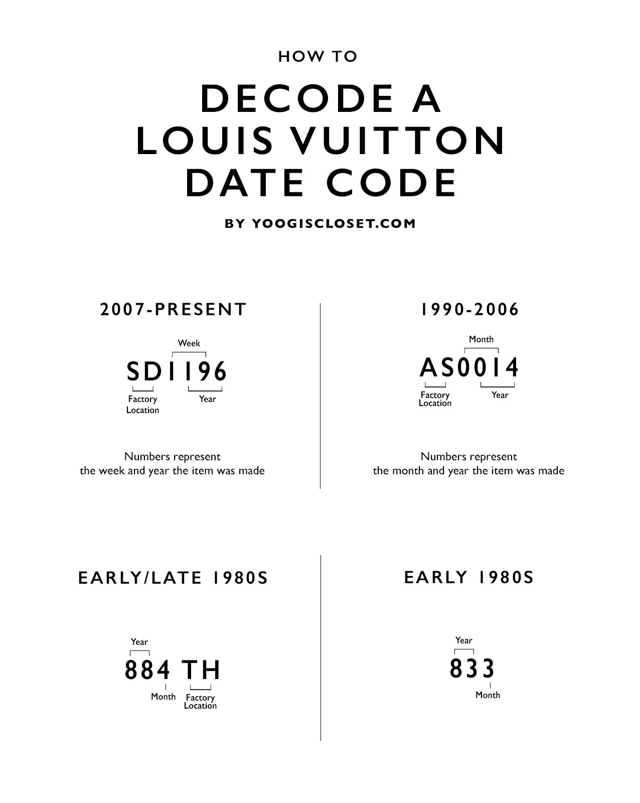

# "LV" Date Code

An intermediate level task for practicing string parsing and data conversion.

LV (multinational corporation specializing in luxury goods) handbags have "date codes" with information about a handbag manufacturing location and date. In the task you have to implement "date code" generation and parsing algorithms for different "date code" formats.

Read more about [LV's "date codes"](https://www.yoogiscloset.com/authenticate/louis-vuitton) before starting work on the task ([Wayback Machine's copy](https://web.archive.org/web/20201112020811/https://www.savvychicconsignment.com/authenticity/louis-vuitton/)).

## Task Description

The first group of [overloaded methods](https://docs.microsoft.com/en-us/dotnet/standard/design-guidelines/member-overloading) should generate a "date code" string using a two-letter factory location code, a manufacturing year and a manufacturing month. The methods are overloaded. The one method should be implemented with "uint" parameters type, the second method should have "[DateTime](https://docs.microsoft.com/en-us/dotnet/api/system.datetime)" parameter type.

1. Implement the GenerateEarly1980Code(uint, uint) and GenerateEarly1980Code(DateTime) methods in the [DateCodeGenerator.cs](LouVuiDateCode/DateCodeGenerator.cs) file.
2. Implement the GenerateLate1980Code(string, uint, uint) and GenerateLate1980Code(DateTime) methods in the [DateCodeGenerator.cs](LouVuiDateCode/DateCodeGenerator.cs) file.
3. Implement the Generate1990Code(string, uint, uint) and Generate1990Code(DateTime) methods in the [DateCodeGenerator.cs](LouVuiDateCode/DateCodeGenerator.cs) file.
4. Implement the Generate2007Code(string, uint, uint) and Generate2007Code(DateTime) method in the [DateCodeGenerator.cs](LouVuiDateCode/DateCodeGenerator.cs) file.

**ISO-8601:** Use [EpochConverter](https://www.epochconverter.com/) for visualizing week numbers (see week number for [1st Jan for 2016 year](https://www.epochconverter.com/weeks/2016)). It is worth noting that Epoch Converter works according to the *[ISO-8601](https://en.wikipedia.org/wiki/ISO_8601)* standard, which applies special rules for calculating days, weeks and years.

Then, implement a helper method that should return a list of countries that have factories with specified factory location code. Two or more countries may have factories with the same location code (for example, France and USA have a factory with the "SD" location code). Countries are implemented as [enumeration type values](https://docs.microsoft.com/en-us/dotnet/csharp/language-reference/builtin-types/enum).

5. Implement the GetCountry method in the [CountryParser.cs](LouVuiDateCode/CountryParser.cs) file.

The next group of methods should parse a "date code" string and return the manufacturing data in [out parameters](https://docs.microsoft.com/en-us/dotnet/csharp/language-reference/keywords/out-parameter-modifier).

6. Implement the ParseEarly1980Code method in the [DateCodeParser.cs](LouVuiDateCode/DateCodeParser.cs) file.
7. Implement the ParseLate1980Code method in the [DateCodeParser.cs](LouVuiDateCode/DateCodeParser.cs) file.
8. Implement the Parse1990Code method in the [DateCodeParser.cs](LouVuiDateCode/DateCodeParser.cs) file.
9. Implement the Parse2007Code method in the [DateCodeParser.cs](LouVuiDateCode/DateCodeParser.cs) file.

Check out the section "See also" for the methods and classes you may use to solve the task.

## See also

* Tutorials
  * [Indices and ranges](https://docs.microsoft.com/en-us/dotnet/csharp/tutorials/ranges-indexes)
* .NET Guide
  * [Standard numeric format strings](https://docs.microsoft.com/en-us/dotnet/standard/base-types/standard-numeric-format-strings)
  * [How to: Pad a Number with Leading Zeros](https://docs.microsoft.com/en-us/dotnet/standard/base-types/how-to-pad-a-number-with-leading-zeros)
* C# Reference
  * [Enumeration types](https://docs.microsoft.com/en-us/dotnet/csharp/language-reference/builtin-types/enum)
  * [out parameter modifier](https://docs.microsoft.com/en-us/dotnet/csharp/language-reference/keywords/out-parameter-modifier)
* .NET API
  * [String.Length Property](https://docs.microsoft.com/en-us/dotnet/api/system.string.length)
  * [String.Chars Property](https://docs.microsoft.com/en-us/dotnet/api/system.string.chars)
  * [String.Format Method](https://docs.microsoft.com/en-us/dotnet/api/system.string.format)
  * [String.ToUpper Method](https://docs.microsoft.com/en-us/dotnet/api/system.string.toupper)
  * [UInt32.ToString Method](https://docs.microsoft.com/en-us/dotnet/api/system.uint32.tostring)
  * [Char.IsLetter Method](https://docs.microsoft.com/en-us/dotnet/api/system.char.isletter)
  * [Array.IndexOf Method](https://docs.microsoft.com/en-us/dotnet/api/system.array.indexof)
  * [Enum Class](https://docs.microsoft.com/en-us/dotnet/api/system.enum)
  * [CultureInfo Class](https://docs.microsoft.com/en-us/dotnet/api/system.globalization.cultureinfo)
  * [GregorianCalendar Class](https://docs.microsoft.com/en-us/dotnet/api/system.globalization.gregoriancalendar)
  * [DateTime Struct](https://docs.microsoft.com/en-us/dotnet/api/system.datetime)
