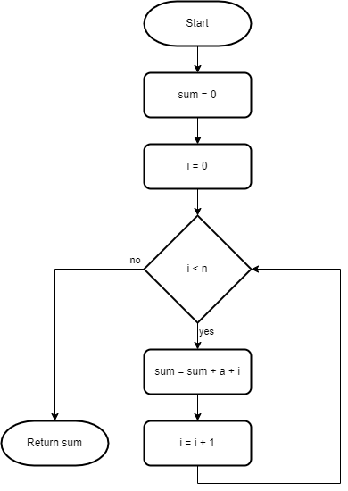
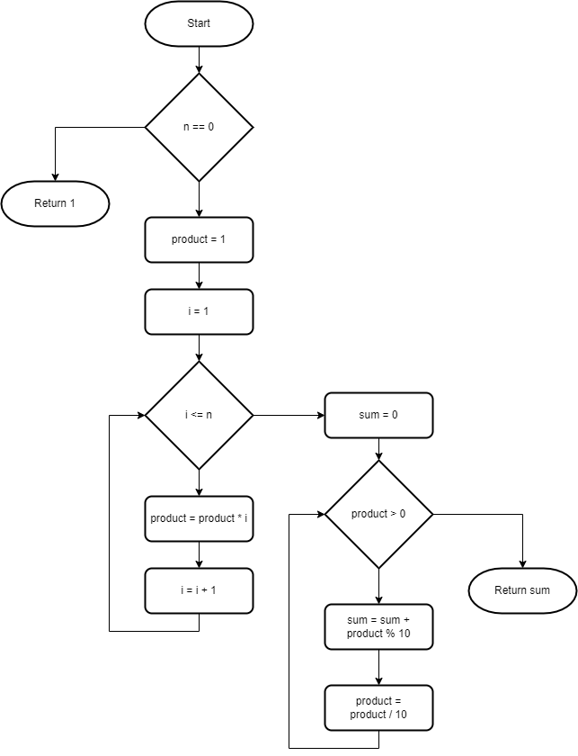
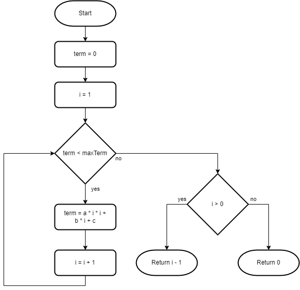
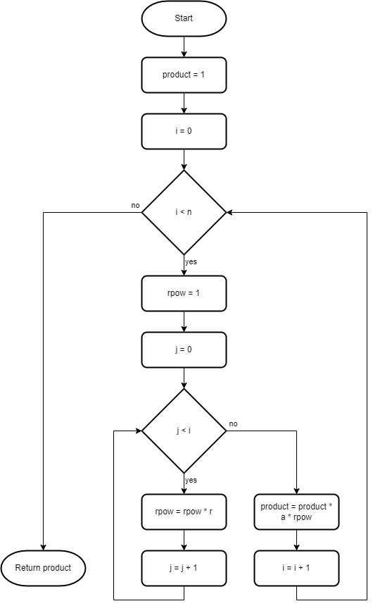
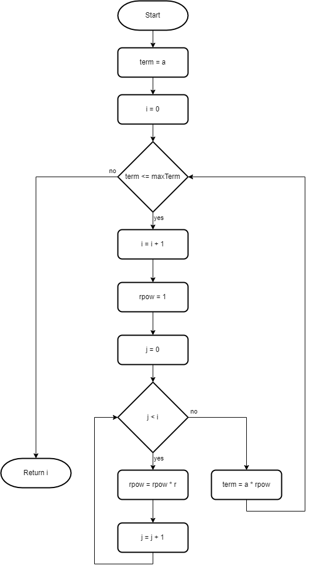
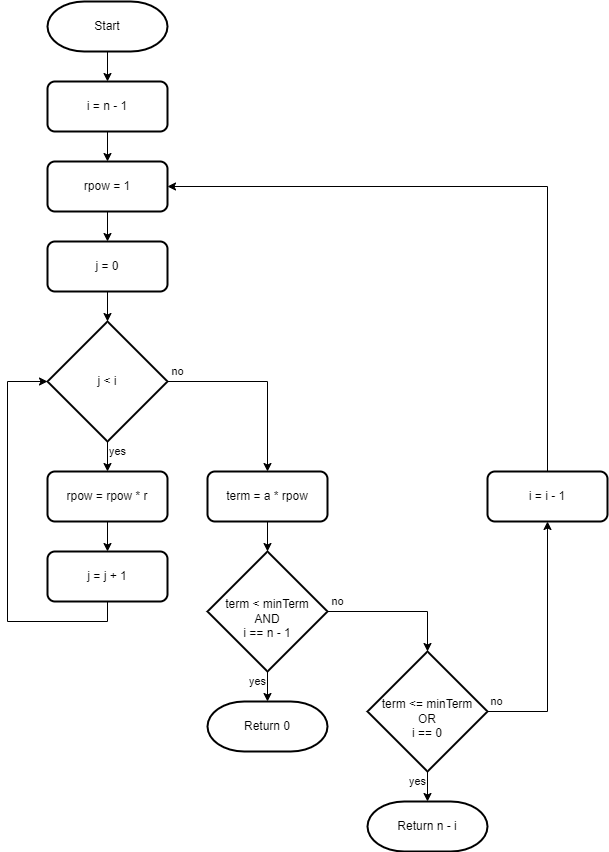

# For Statements

Beginner level task for practicing `for` statements.

Estimated time to complete the task - 3h.

The task requires .NET 6 SDK installed.


## Task Description

The task has sixteen tasks in six sections. Each task is a small coding exercise.

Basic understanding of [flowchart diagrams](https://en.wikipedia.org/wiki/Flowchart) is required to successfully complete the task. If you are not familiar with flowchart diagrams, read the Wikipedia article first.

Use the only `for` and `if-else` statements in this task. Using `while` or `do-while` iteration statements is not required.


### Arithmetic Sequences

An [arithmetic sequence](https://www.google.com/search?q=arithmetic+sequence) is an ordered set of terms (numbers) that have a common difference between each consecutive term.

The arithmetic sequence formula is given as,

$`a_{n} = a+(n-1)\cdot{d}`$

where,
* $`a_{n}`$ is the nth term,
* $`a`$ is the first term, and
* d is the [common difference](https://www.google.com/search?q=arithmetic+sequence+common+difference).


#### Task 1

Open the [ArithmeticSequences.cs](ForStatements/ArithmeticSequences.cs) file, and navigate to the [SumArithmeticSequenceTerms1](ForStatements/ArithmeticSequences.cs#L5) method.

Implement the method that returns sum of an arithmetic sequence terms if the common difference is 1.

$`\sum_{i=1}^{n} a+(i-1)\cdot{1}=\sum_{i=0}^{n-1} a+i`$

For the arithmetic sequence $`{5, 6, 7, 8, 9, ...}`$ the sum of the first five elements is 35 (5 + 6 + 7 + 8 + 9).

The algorithm you have to implement is shown on the flowchart diagram below. The flowchart notation has no special symbol for a `for` statement, therefore a decision block is used in the diagram.



Read and analyze the diagram, add the code to the _SumArithmeticSequenceTerms1_ method. 

1. Declare and initialize the _sum_ and the _i_ variables. Add the [return statement](https://docs.microsoft.com/en-us/dotnet/csharp/language-reference/statements/jump-statements#the-return-statement) to return the _sum_ value.

```cs
public static int SumArithmeticSequenceTerms1(int a, int n)
{
    int sum = 0;

    return sum;
}
```

2. Add the [for statement](https://docs.microsoft.com/en-us/dotnet/csharp/language-reference/statements/iteration-statements#the-for-statement) that iterates until _i_ is less than _n_. The `for` statement has three elements - _initializer_, _condition_ and _iterator_ sections.

```cs
public static int SumArithmeticSequenceTerms1(int a, int n)
{
    int sum = 0;

    for (int i = 0; i < n; i = i + 1)
    {
    }

    return sum;
}
```


3. Add the sum calculation.

```cs
public static int SumArithmeticSequenceTerms1(int a, int n)
{
    int sum = 0;

    for (int i = 0; i < n; i = i + 1)
    {
        sum = sum + a + i;
    }

    return sum;
}
```

4. Replace the assignment with [addition assignment operator +=](https://docs.microsoft.com/en-us/dotnet/csharp/language-reference/operators/addition-operator).

```cs
public static int SumArithmeticSequenceTerms1(int a, int n)
{
    int sum = 0;

    for (int i = 0; i < n; i = i + 1)
    {
        sum += a + i;
    }

    return sum;
}
```

5. Replace the assignment with [increment operator++](https://docs.microsoft.com/en-us/dotnet/csharp/language-reference/operators/arithmetic-operators#increment-operator-).

```cs
public static int SumArithmeticSequenceTerms1(int a1, int n)
{
    int sum = 0;

    for (int i = 0; i < n; i++)
    {
        sum += a + i;
    }

    return sum;
}
```


#### Task 2

Open the [ArithmeticSequences.cs](ForStatements/ArithmeticSequences.cs) file, and navigate to the [SumArithmeticSequenceTerms2](ForStatements/ArithmeticSequences.cs#L11) method.

Implement the method that returns the sum of an arithmetic sequence elements when the first term is 47 and the common difference is 13.

$`\sum_{i=1}^{n} 47+(i-1)\cdot{13}=\sum_{i=0}^{n-1} 47+i\cdot{13}`$

Beginner programmers often put number literals in their code like this:

```cs
public static int SumArithmeticSequenceTerms2(int n)
{
    int sum = 0;

    for (int i = 0; i < n; i++)
    {
        sum += 47 + (i * 13);
    }

    return sum;
}
```

Experienced programmers consider using number literals with unexplained meaning as a *bad practice*. They call such literals [magic numbers](https://en.wikipedia.org/wiki/Magic_number_(programming)).

If you have a magic number in your code, [replace it with a symbolic constant](https://refactoring.guru/replace-magic-number-with-symbolic-constant):

```cs
public static int SumArithmeticSequenceTerms2(int n)
{
    const int firstTerm = 47;
    const int commonDifference = 13;

    int sum = 0;

    for (int i = 0; i < n; i++)
    {
        sum += firstTerm + (i * commonDifference);
    }

    return sum;
}
```


#### Task 3

Open the [ArithmeticSequences.cs](ForStatements/ArithmeticSequences.cs) file, and navigate to the [SumArithmeticSequenceTerms3](ForStatements/ArithmeticSequences.cs#L17) method.

Implement the method that returns the sum of an arithmetic sequence elements when the common difference is 5.

$`\sum_{i=1}^{n} a+(i-1)\cdot{5}=\sum_{i=0}^{n-1} a+i\cdot{5}`$

Introduce a constant to avoid magic numbers in your code.


### Factorial

The [factorial](https://en.wikipedia.org/wiki/Factorial) of a non-negative integer $`n`$, denoted by $`n!`$, is the product of all positive integers less than or equal to $`n`$.

$`n!=\prod_{i=1}^{n}i=1\cdot...\cdot(n-1)\cdot{n}`$


#### Task 4

Open the [Factorial.cs](ForStatements/Factorial.cs) file, and navigate to the [GetFactorial](ForStatements/Factorial.cs#L5) method.

Implement the method that returns the factorial of the number $`n!`$ using the `for` statement.


#### Task 5

Open the [Factorial.cs](ForStatements/Factorial.cs) file, and navigate to the [SumFactorialDigits](ForStatements/Factorial.cs#L11) method.

Implement the method that calculates the factorial of the number $`n!`$ and returns the sum of its digits using the `for` statement.

$`10!=1\cdot{2}\cdot{3}\cdot{4}\cdot{5}\cdot{6}\cdot{7}\cdot{8}\cdot{9}\cdot{10}=3628800`$

The sum of digits of 3,628,800 is 27 (3+6+2+8+8).

The algorithm you have to implement is shown on the flowchart diagram below.



Use the [remainder operator %](https://docs.microsoft.com/en-us/dotnet/csharp/language-reference/operators/arithmetic-operators#remainder-operator-) to get the last digit of factorial of a number.

The expression in the condition section may use any variable, not only variables mentioned in the initializer or iterator sections.

```cs
for (int sum = 0; product > 0; product = product / 10)
{
    sum += product % 10;
}
```

Use the [compound assignment expression](https://docs.microsoft.com/en-us/dotnet/csharp/language-reference/operators/assignment-operator#compound-assignment) instead of the division operator.

```cs
for (int sum = 0; product > 0; product /= 10)
{
    sum += product % 10;
}
```

You can leave any section empty if this makes sense for your algorithm:

```cs
int sum = 0;

for (; product > 0; product /= 10)
{
    sum += product % 10;
}

return sum;
```


### Quadratic Sequences

A [quadratic sequence](https://www.google.com/search?q=quadratic+sequence) is an ordered set of terms that follows a rule based on the sequence $`n^2=1, 4, 9, 16, 25, ...`$.

The quadratic sequence formula is:

$`a_{n} = a\cdot{n^2}+b\cdot{n}+c`$

where,
* $`a_{n}`$ is the nth term, and
* $`a`$, $`b`$ and $`c`$ are constants.


#### Task 6

Open the [QuadraticSequences.cs](ForStatements/QuadraticSequences.cs) file, and navigate to the [CountQuadraticSequenceTerms](ForStatements/QuadraticSequences.cs#L5) method.

Implement the method that returns the number of the quadratic sequence terms that are less than or equals to the _maxTerm_.

The quadratic sequence with nth term $`a_{n}=3\cdot{n^2}+5\cdot{n}+7`$ is $`\{ 15, 29, 49, 75, 107, 145, ...\}`$.

If _maxTerm_ is 29, the number of terms is 2 (15 and 29 terms). If _maxTerm_ is 107, the number of terms is 5 (15, 29, 49, 75 and 107 terms).

The algorithm you have to implement is shown on the flowchart diagram below.




#### Task 7

Open the [QuadraticSequences.cs](ForStatements/QuadraticSequences.cs) file, and navigate to the [GetQuadraticSequenceTermsProduct1](ForStatements/QuadraticSequences.cs#L11) method.

Implement the method that returns the product of the first _count_ quadratic sequence terms.

The quadratic sequence with nth term $`a_{n}=7\cdot{n^2}+4\cdot{n}+2`$ is $`\{ 13, 38, 77, 130, ...\}`$.

If the _count_ is 2, the product is 494 (13 * 38 = 494). If the _count_ is 3, the product is 38038 (13 * 38 * 77 = 38038).


#### Task 8

Open the [QuadraticSequences.cs](ForStatements/QuadraticSequences.cs) file, and navigate to the [GetQuadraticSequenceTermsProduct2](ForStatements/QuadraticSequences.cs#L17) method.

Implement the method that returns the product of _count_ quadratic sequence terms starting with the _startN_ term.

For the quadratic sequence $`\{ 15, 29, 49, 75, ...\}`$ the product is 435 (15 * 29 = 435), if the _startN_ is 1 and _count_ is 2. If _startN_ is 2 and _count_ is 3, the product is 106575 (29 * 49 * 75 = 106575).


### Fibonacci Sequence

The [Fibonacci sequence](https://www.google.com/search?q=fibonacci+sequence) is the series of numbers:

$`\{ 0, 1, 1, 2, 3, 5, 8, 13, 21, 34, ... \}`$

The sequence rule is:

$`x_{n}=x_{n-1}+x_{n-2}`$

where,
* $`x_{n}`$ is term number "n",
* $`x_{n-1}`$ is the previous term (n-1),
* $`x_{n-2}`$ is the term before that (n-2).


#### Task 9

Open the [FibonacciSequence.cs](ForStatements/FibonacciSequence.cs) file, and navigate to the [GetFibonacciNumber](ForStatements/FibonacciSequence.cs#L5) method.

Implement the method that returns the Fibonacci sequence number using the `for` statement.


#### Task 10

Open the [FibonacciSequence.cs](ForStatements/FibonacciSequence.cs) file, and navigate to the [GetProductOfFibonacciNumberDigits](ForStatements/FibonacciSequence.cs#L11) method.

Implement the method that returns the product of digits of the Fibonacci sequence number using the `for` statement. Use the [remainder operator %](https://docs.microsoft.com/en-us/dotnet/csharp/language-reference/operators/arithmetic-operators#remainder-operator-) to get the last digit of factorial of a number.

If $`n`$ is 10, the $`n`$-th Fibonacci sequence number is 55 and the product of the number digits is 25 (5 * 5).


### Geometric Sequences

A [geometric sequence](https://www.google.com/search?q=geometric+sequence) is a sequence of terms in which the ratio between consecutive terms is constant.

The geometric sequence formula is given as,

$`a_{n} = a\cdot{r^n}`$

where,
* $`a_{n}`$ is the nth term,
* $`a`$ is the first term, and
* r is the [common ratio](https://www.google.com/search?q=geometric+sequence+common+ratio).


#### Task 11

Open the [GeometricSequences.cs](ForStatements/GeometricSequences.cs) file, and navigate to the [GetGeometricSequenceTermsProduct](ForStatements/GeometricSequences.cs#L5) method.

Implement the method that returns the product of geometric sequence terms.

$`\prod_{i=1}^{n}a\cdot{r^{i-1}}=\prod_{i=0}^{n-1}a\cdot{r^{i}}=(a\cdot{1})\cdot(a\cdot{r^1})\cdot(a\cdot{r^2})\cdot(a\cdot{r^3})\cdot...\cdot(a\cdot{r^{n-1}})`$

Use a nested `for` loop to raise an _r_ number to a power. The [.NET BCL](https://docs.microsoft.com/en-us/dotnet/standard/glossary) has a special [Math.Pow](https://docs.microsoft.com/en-us/dotnet/api/system.math.pow) method for raising a number to a power, but since you in this you practice loops use the `for` loop instead of the _Math.Pow_ method.

```cs
uint rpow = 1;
for (int j = 0; j < i; j++)
{
    rpow *= r;
}
```

The algorithm you have to implement is shown on the flowchart diagram below.




#### Task 12

Open the [GeometricSequences.cs](ForStatements/GeometricSequences.cs) file, and navigate to the [SumGeometricSequenceTerms](ForStatements/GeometricSequences.cs#L11) method.

Implement the method that returns the sum of a geometric sequence terms when the first term is 5 and the common ratio is 3.

$`\sum_{i=1}^{n}a\cdot{r^{i-1}}=\sum_{i=0}^{n-1} 5\cdot{3^{i}}=5+5\cdot{3^1}+5\cdot{3^2}+5\cdot{3^3}+...+5\cdot{3^{n-1}}`$

Introduce a constant to avoid magic numbers in your code.


#### Task 13

Open the [GeometricSequences.cs](ForStatements/GeometricSequences.cs) file, and navigate to the [CountGeometricSequenceTerms1](ForStatements/GeometricSequences.cs#L17) method.

Implement the method that counts terms in a geometric sequence that are less than or equal to the _maxTerm_.

If _a_ is 3 and _r_ is 2 the geometric sequence is $`\{3, 6, 12, 24, 48, ...\}`$. If _maxTerm_ is 3 the count equals to 1 ($`\{3\}`$). If  _maxTerm_ is 24 the count equals to 4 ($`\{3, 6, 12, 24\}`$).

The algorithm you have to implement is shown on the flowchart diagram below.



To implement this algorithm, leave the iterator section in the `for` statement empty and increment the _i_ variable in the loop body:

```cs
ulong i = 0;

for (; term <= maxTerm;)
{
    i++;
    // ...
}
```


#### Task 14

Open the [GeometricSequences.cs](ForStatements/GeometricSequences.cs) file, and navigate to the [CountGeometricSequenceTerms2](ForStatements/GeometricSequences.cs#L23) method.

Implement the method that counts terms in a geometric sequence that are greater than or equal to a _minTerm_.

For the geometric sequence $`\{3, 6, 12, 24, 48, 96, 192, 384, 768, 1536, ...\}`$ the count equals to 4 ($`\{192, 384, 768, 1536\}`$) when _n_ is 10 and the _minTerm_ is 192 . If _minTerm_ is 768 the count equals to 2 (768 and 1536).

The algorithm you have to implement is shown on the flowchart diagram below.



To implement this algorithm, leave the iterator, condition and increment sections empty.

```cs
for (; ;)
{
    // ...
}
```

The `for` statement with empty sections is fully equivalent to the `while` statement with the condition that is always evaluates to `true`:

```cs
while (true)
{
    // ...
}
```

These language constructions can be used interchangeably.

Use the [break statement](https://docs.microsoft.com/en-us/dotnet/csharp/language-reference/statements/jump-statements#the-break-statement) to terminate the loop execution, and return the expected value.

```cs
for (; ;)
{
    // ...

    if (term <= minTerm || i == 0)
    {
        break;
    }

    // ...
}

return n - i;
```

Logical errors in loop design or loop conditions often leads to [infinite loops](https://en.wikipedia.org/wiki/Infinite_loop). These are hard-to-find kind of issues, especially in a production environment.


### Prime Numbers

#### Sub-task 15

Open the [PrimeNumbers.cs](ForStatements/PrimeNumbers.cs) file, and navigate to the [IsPrimeNumber](ForStatements/PrimeNumbers.cs#L5) method.

Implement the method that returns true when $`n`$ is a prime number; otherwise the method returns false.


#### Sub-task 16

Open the [PrimeNumbers.cs](ForStatements/PrimeNumbers.cs) file, and navigate to the [SumDigitsOfPrimeNumbers](ForStatements/PrimeNumbers.cs#L11) method.

Implement the method that returns the sum of digits of all prime numbers in the [start, end] interval.

The prime numbers in the [10, 20] interval are 11, 13, 17 and 19. The sum of the digits in all these numbers is 24 (1 + 1 + 1 + 3 + 1 + 7 + 1 + 9). Use the [break](https://docs.microsoft.com/en-us/dotnet/csharp/language-reference/statements/jump-statements#the-break-statement) and [continue](https://docs.microsoft.com/en-us/dotnet/csharp/language-reference/statements/jump-statements#the-continue-statement) statements to make your algorithm more efficient.


## Fix Compiler Issues

Additional style and code checks are enabled for the projects in this solution to help you maintaining consistency of the project source code and avoiding silly mistakes. [Review the Error List](https://docs.microsoft.com/en-us/visualstudio/ide/find-and-fix-code-errors#review-the-error-list) in Visual Studio to see all compiler warnings and errors.

If a compiler error or warning message is not clear, [review errors details](https://docs.microsoft.com/en-us/visualstudio/ide/find-and-fix-code-errors#review-errors-in-detail) or google the error or warning code to get more information about the issue.


## Task Checklist

1. Rebuild the solution.
1. Fix all compiler warnings and errors.
1. Run all unit tests, make sure all unit tests completed successfully.
1. Review all changes, make sure the only code files (.cs) in ForStatements project have changes. No changes in project files (.csproj) or in ForStatements.Tests project.
1. Stage your changes, and create a commit.
1. Push your changes to remote repository.


## See also

* C# Language Reference
  * [The for statement](https://docs.microsoft.com/en-us/dotnet/csharp/language-reference/statements/iteration-statements#the-for-statement)
  * [The break statement](https://docs.microsoft.com/en-us/dotnet/csharp/language-reference/statements/jump-statements#the-break-statement)
  * [The continue statement](https://docs.microsoft.com/en-us/dotnet/csharp/language-reference/statements/jump-statements#the-continue-statement)
  * [The return statement](https://docs.microsoft.com/en-us/dotnet/csharp/language-reference/statements/jump-statements#the-return-statement)
  * [Increment operator](https://docs.microsoft.com/en-us/dotnet/csharp/language-reference/operators/arithmetic-operators#increment-operator-)
  * [Decrement operator](https://docs.microsoft.com/en-us/dotnet/csharp/language-reference/operators/arithmetic-operators#decrement-operator---)
  * [Compound assignment](https://docs.microsoft.com/en-us/dotnet/csharp/language-reference/operators/arithmetic-operators#compound-assignment)
